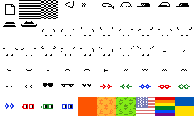

# D.I.Y. Lost Files (Portrait) Collection Starter  - Classic & Maxi Biz Editions


[Classic Edition](#classic-edition)  • 
[Maxi Biz Edition](#maxi-biz-edition)


## Classic Edition

The idea is re(use) or "recurse on" all 5 .PNG (spritesheet) inscriptions - base, arms & legs, mouth, hat, & eyes (in 96×96px) with 16 sprites / tiles each in the lost files (GRC-img v1) collection. Why not do-it-yourself (d.i.y)?
Why not free mint (first-come/first-serve)?


###  Wen Deploy? Wen Mint?

Here's everything to make it happen - yes, you can. 

#### Step 1:  Inscribe the collection deploy text 

```
og deploy lostfiles
name: Lost Files (Portrait)
max: 44
dim: 24x24
a3fb4ad6ed9654f236a2cb82a101022937c4aecabee4e6b3485e4f0fe26cd855i0
51462e54abfc85be2f813b275ee7ae71f787a771dd14cdd7cf1bf351fa0aa98bi0
1f2fa0155e47da349d964c79561db50af509ae2ce3fc7ee398fab904cba4cca5i0
edb39fd1f0f33b9e989fa32a5a9a2962f806f4cd487f7e30f700014f13ed19aci0
1199a91694b810b8d65270d5826262240d998ef5e295358e919318bd8e65f016i0
```


That's it. Yes, you can - start a free mint (first-come/first-serve).


<!--
Note: You are more than welcome to change
the collection slug `lostfiles`
or the name e.g. Lost Files (Portrait)
or the max (limit) e.g. 44 to your own liking.

Note: The collection slug MUST be unique and not yet taken / deployed.
Tip: Search for `og deploy` to see if taken / deployed 
e.g. try [`unisat.io/search?q=og deploy&type=text`](https://unisat.io/search?q=og%20deploy&type=text&p=1), for example.  
-->


Wen [next] deploy?   You are welcome to announce your ordgen / ORC-721 collections
in the [ordinal punks](https://ordinalpunks.com) discord (in the #generative-orc-721 channel)
or in the [ordinal phunks](https://twitter.com/OrdinalPhunksV0) discord (in the #random / General channel).


### Classic Mint Samples


To find your g(enerative) numbers in range 0-79 (80) for the mint text - try the [D.I.Y. Lost Files (Portrait) Previewer, Classic Edition »](https://orc721.github.io/lostfiles.starter/preview/classic)


`og mint lostfiles 0 20 35 58 74`


`og mint lostfiles 13 22 46 52 69`


## Maxi Biz Edition

The idea is ... for more fun let's turn "classic"
Lost Files into a Maxi Biz edition ...

1. all black & white (1-bit) and  
2. laser eyes in r/g/b (red/green/blue) and 
3. optional backgrounds.


###  Wen Deploy? Wen Mint?

Here's everything to make it happen - yes, you can. 


#### Step 1: Inscribe spritesheet.png (<2kb)




#### Step 2:  Inscribe the collection deploy text 

Note: Fill-in the inscribe / inscription id 
for the inscribed spritesheet.png above.


```
og deploy lostmaxibizfiles
name: Lost Maxi Biz Files (Portrait)
max: 44
dim: 24x24
<inscribe_id_here>
```

That's it. Yes, you can - start a free mint (first-come/first-serve).

Wen [next] deploy?   You are welcome to announce your ordgen / ORC-721 collections
in the [ordinal punks](https://ordinalpunks.com) discord (in the #generative-orc-721 channel)
or in the [ordinal phunks](https://twitter.com/OrdinalPhunksV0) discord (in the #random / General channel).


### Maxi Biz Mint Samples


To find your g(enerative) numbers in range 0-59 (60) for the mint text - try the [D.I.Y. Lost Maxi Biz Files (Portrait) Previewer »](https://orc721.github.io/lostfiles.starter/preview)


`og mint lostmaxibizfiles 54 0 12 30 5 49`


`og mint lostmaxibizfiles 54 0 12 30 5 49 56 0 27 28 52`


## Questions? Comments?

Please post in the [ordinal punks](https://ordinalpunks.com) discord (in the #generative-orc-721 channel)
or in the [ordinal phunks](https://twitter.com/OrdinalPhunksV0) discord (in the #random / General channel).